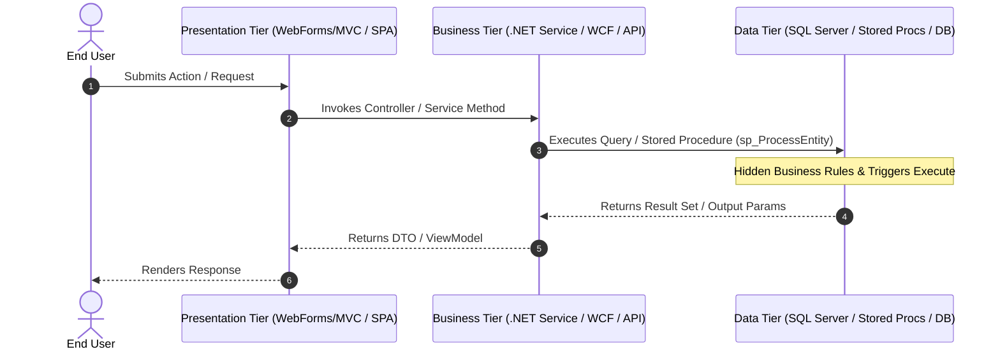

# Brownfield Baseline Specification: [SYSTEM_OR_SUBSYSTEM_NAME]

| Metadata | Details |
| :--- | :--- |
| **Baseline ID** | `BASELINE-YYYYMMDD-001` |
| **Status** | `Draft` \| `In Review` \| `Verified Baseline` |
| **Assessment Track** | `Track A: Legacy 3-Tier / .NET Framework` \| `Track B: Modern Cloud-Native (Undocumented/Untested)` \| `Hybrid` |
| **Selected Modernization Strategy** | `Strangler Fig / API Facade` \| `Full Dual-Runtime Re-Architecture` \| `In-Place Cloud-Native Hardening` |
| **Companion Artifacts** | `docs/<project>-as-is-vs-target-architecture.md` \| `docs/codemender-01-vulnerability-scan-report.md` |
| **Last Updated** | `YYYY-MM-DD` |

---

## 1. Executive Summary & Brownfield Classification

### 1.1 System Purpose & Current Operational Footprint
*(Summarize what the existing system or subsystem currently does in production, who uses it, and its current hosting/deployment environment.)*

### 1.2 Brownfield Track Classification
- [ ] **Track A — Legacy Enterprise / 3-Tier Application (e.g., .NET Framework, ASP.NET WebForms/MVC, WCF/SOAP, SQL Server Stored Procedures):**
  - Characterized by tightly coupled UI/Business/Data tiers, server-side session/state (`ViewState`, `HttpContext.Session`), configuration in `Web.config`/`App.config`, and business rules embedded in SQL Stored Procedures or Triggers.
- [ ] **Track B — Modern Cloud-Native Codebase Lacking Documentation & Testing (e.g., React/Node/Python/Go microservices, ad-hoc LLM/Agent code):**
  - Characterized by modern frameworks or containers that grew organically without formal specifications, type contracts, unit/property-based tests, or strict separation between `agent_runtime` and `cloud_run`.

---

## 2. "As-Is" Architecture & 3-Tier / Component Inventory

### 2.1 Current Tier & Component Breakdown
| Tier / Layer | Legacy / Existing Component | Technology & Version | Source Path(s) | Key Responsibilities & State Coupling |
| :--- | :--- | :--- | :--- | :--- |
| **Presentation / UI Tier** | *(e.g., ASP.NET MVC / WebForms / Unspecified React SPA)* | *(e.g., .NET 4.8 / React 18)* | `...` | *(e.g., Renders views, holds Session/ViewState, direct controller calls)* |
| **Business / Application Tier** | *(e.g., C# Class Libraries, WCF `.svc`, FastAPI/Express routes, inline LLM calls)* | *(e.g., WCF / Python 3.11)* | `...` | *(e.g., Order validation, pricing rules, synchronous SOAP calls)* |
| **Data & Persistence Tier** | *(e.g., SQL Server DB, Stored Procs, Triggers, ORM / Firestore)* | *(e.g., MSSQL 2019 / EF6)* | `...` | *(e.g., Tables, 45 Stored Procedures, 8 Triggers, nightly batch jobs)* |
| **Infrastructure & Config** | *(e.g., IIS 10, Windows Server VM, `Web.config`, scattered `.env`)* | *(e.g., IIS / Docker)* | `...` | *(e.g., Integrated Windows Auth, connection strings, appSettings)* |

### 2.2 "As-Is" Data Flow & Sequence Diagram


---

## 3. Reverse-Engineered Data Models & Hidden Logic Catalog

### 3.1 Core Data Entities & Schemas (As-Is)
*(Document existing C# DTOs/Entities, TypeScript interfaces, Python classes, and SQL DDL tables.)*

```sql
-- As-Is Database Table & Constraints
```

### 3.2 Hidden Business Logic Extraction Matrix (Critical for Legacy 3-Tier & Undocumented Code)
*(Catalog all implicit business logic discovered inside SQL Stored Procedures, Triggers, WCF Services, `Web.config` transforms, code-behind `.aspx.cs` files, or undocumented middleware.)*

| Logic ID | Source Location (File / Stored Proc / Trigger) | Discovered Business Rule / Calculation | Side Effects / State Mutations | Target Destination in Modernized Architecture |
| :--- | :--- | :--- | :--- | :--- |
| `BL-001` | *(e.g., `dbo.usp_CalculateDiscount`)* | *(e.g., Applies tiered discount if customer tenure > 3 yrs)* | *(Updates `AuditLog` table via trigger `trg_OrderUpdate`)* | *(Extract to explicit domain service / `FunctionTool`)* |
| `BL-002` | *(e.g., `OrderController.cs:L142`)* | *(e.g., Rejects payload when `Status == 4` and `Region != 'US'`)* | *(Writes to `HttpContext.Session["LastError"]`)* | *(Codify in Pydantic/TypeScript schema + stateless API)* |

---

## 4. "As-Is" API, Service & External Integration Contracts

### 4.1 Existing Endpoints / WCF Operations / RPCs
- **Operation / Endpoint:** `POST /api/...` or `IServiceContract.OperationName`
- **Authentication Mechanism:** *(e.g., Windows Auth / AD, Legacy Cookie, Bearer Token, Unauthenticated)*
- **Request Payload / Parameters:**
- **Response Payload & Error Codes:**

### 4.2 External Dependencies & Configuration Inventory (`Web.config` / `.env`)
| Config Key / Connection String | Current Source (`Web.config` / `.env.*` / Hardcoded) | Purpose | Target Unified `.env` Mapping (`NONPROD_*` / `PROD_*`) |
| :--- | :--- | :--- | :--- |
| `DefaultConnection` | `Web.config <connectionStrings>` | Primary SQL DB | `NONPROD_DB_URI` / `PROD_DB_URI` |

---

## 5. Ambiguities, Legacy Quirks & Defect Triage Log (`ask_question` Decisions)

*(All undocumented behaviors, dead code paths, or suspected bugs discovered during reverse-engineering MUST be clarified with the user via `ask_question` before locking in the baseline.)*

| Item ID | Source Location | Observed Behavior / Anomaly | User Decision (`ask_question`) | Action in Target Spec |
| :--- | :--- | :--- | :--- | :--- |
| `AMB-01` | `...` | *(e.g., Negative quantities silently rounded to 0 instead of throwing 400)* | `Preserve as Baseline Invariant` \| `Remediate as Defect` | *(e.g., Keep in characterization test OR fix in SPEC-YYYYMMDD)* |

---

## 6. Core System Invariants & Characterization Test Suite (Safety Net)

*(Before modifying or migrating any brownfield code—especially modern cloud-native code lacking tests or legacy 3-tier business logic—these invariants MUST be verified by automated Characterization Unit Tests and Property-Based Tests.)*

### 6.1 Deterministic Characterization Tests (Golden Master / Approval Tests)
- **Test Suite Location:** `tests/characterization/` or `tests/unit/baseline/`
- **Captured Scenarios:**
  1. Happy-path input/output parity against existing implementation.
  2. Edge cases and error responses confirmed in Section 5.

### 6.2 Generative Property-Based Tests (PBT) for Baseline Invariants
- **PBT Framework:** `hypothesis` (Python) / `fast-check` (TypeScript) / `FsCheck` (.NET)
- **Verified Mathematical & Domain Invariants:**
  - **Invariant 1 (Idempotency / Calculation Parity):** `∀ valid_input: modernized_fn(valid_input) == legacy_baseline_fn(valid_input)`
  - **Invariant 2 (Serialization / Schema Round-Trip):** `∀ entity: deserialize(serialize(entity)) == entity`
  - **Invariant 3 (State & Boundary Conservation):** *(e.g., Account balance / inventory totals never become negative across arbitrary transaction sequences).*

---

## 7. Governance & Dual-Runtime Compliance Gap Matrix

| Governance Rule | Current Brownfield State ("As-Is") | Compliance Status | Remediation Required in Target Feature SDD |
| :--- | :--- | :--- | :--- |
| **Dual-Runtime Split (`AGENTS.md`)** | *(e.g., Monolithic 3-tier app or LLM calls embedded in Express/FastAPI)* | `Non-Compliant` \| `Compliant` | Decouple AI agents to `agent_runtime` (`google-adk`) and UI/Proxy to `cloud_run`. |
| **Cognitive Agent Reasoning (Rule 13)** | *(e.g., Regex/keyword intent routing or hardcoded `if/else` chains)* | `Non-Compliant` \| `N/A` | Replace with ADK `OrchestratorAgent` + Canonical MECE Intent Topology (`OTHERS` included). |
| **Pre-Build CodeMender SAST (Rule 3)** | *(Baseline scan: `docs/codemender-01-vulnerability-scan-report.md`)* | `Pending` \| `Audited` | Remediate all Critical/High vulnerabilities before deployment. |
| **Cloud Run `/healthz` & Observability (Rule 6)** | *(e.g., No `/healthz` endpoint; unstructured console/file logs)* | `Non-Compliant` \| `Compliant` | Add `GET /healthz` probe and structured JSON logging to Cloud Logging. |
| **Unified Single-File `.env` (Rule 8)** | *(e.g., `Web.config`, multiple `.env.*` files, or hardcoded constants)* | `Non-Compliant` \| `Compliant` | Consolidate into single `.env` (`NONPROD_*` and `PROD_*` blocks). |
| **Domain Restricted Sharing IAM (Rule 10)** | *(e.g., On-prem IIS / AD or Cloud Run `allUsers`)* | `Non-Compliant` \| `Compliant` | Adopt Pattern 1 (IAP), Pattern 2 (App OAuth 2.0), or Pattern 3 (`invoker-iam-disabled`). |

---

## 8. Confirmed Modernization & Remediation Strategy

*(Confirmed with stakeholder via `ask_question` during Phase 1 / Phase 2 Step 2.0)*

- **Selected Strategy:**
  - [ ] **Option 1: Strangler Fig / Incremental API Facade** — Keep legacy .NET/3-Tier database or core services running while carving out bounded contexts into Cloud Run (`cloud_run`) and Gemini Enterprise Agent Platform (`agent_runtime`) behind an API Gateway/Proxy.
  - [ ] **Option 2: Full Dual-Runtime Re-Architecture** — Extract all presentation, business logic (including SQL Stored Procedure rules), and AI capabilities into a clean Cloud Run (`src/`, `server/`) + Google ADK (`app/`) architecture with full PBT parity verification.
  - [ ] **Option 3: In-Place Cloud-Native Hardening (Track B)** — Preserve existing modern cloud-native codebase structure while backfilling SDD contracts, Characterization + Property-Based Tests, `/healthz`, unified `.env`, and ADK `agent_runtime` decoupling.
