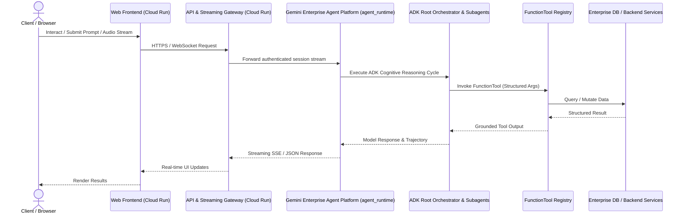

# Specification: [SPEC-YYYYMMDD-TITLE]

## 1. Problem Statement & Objectives
- **Context & Motivation:** Describe the background, current pain points, and business/technical driver.
- **Goals:** Measurable, concrete outcomes expected from this implementation.
- **Non-Goals:** Explicitly out-of-scope items to prevent scope creep.

---

## 2. System Architecture & Component Interaction

### 2.1 Runtime Boundary & Separation of Responsibilities
This project enforces a strict architectural boundary between client-facing web workloads and autonomous AI agent reasoning engines:

| Dimension | Conversational AI Agents & Reasoning Engine | Web Frontend, API Gateway & Streaming Proxies |
| :--- | :--- | :--- |
| **Target Runtime** | **Gemini Enterprise Agent Platform (`agent_runtime`)** | **Google Cloud Run (`cloud_run`)** |
| **Deployed Artifacts** | ADK Root Coordinator (`OrchestratorAgent`), Domain Subagents, cognitive prompts, and `FunctionTool` registries. | React/Vite web application, Express/FastAPI reverse proxy, WebSocket/SSE streaming endpoints, and auxiliary jobs. |
| **Deployment Mechanism** | `agents-cli deploy --deployment-target agent_runtime` | Google Cloud Build (`cloudbuild.yaml`) + Terraform via Google Cloud Infrastructure Manager |
| **Core Responsibilities** | LLM reasoning, multi-turn session persistence (`agentengine://`), pre-flight Model Armor guardrails, tool execution, and trajectory evaluation (`agents-cli eval`). | HTTP/HTTPS ingress, IAP authentication gateway, client UI rendering, health probes (`/healthz`), and thin proxying to the Agent Platform. |
| **Governance Rule** | [`_agents/rules/google_adk_and_agent_runtime.md`](../../_agents/rules/google_adk_and_agent_runtime.md) | [`_agents/rules/devops_security_and_quality_standards.md`](../../_agents/rules/devops_security_and_quality_standards.md) |

### 2.2 Sequence / Interaction Diagram


---

## 3. Data Models & Type Contracts
Single source of truth schemas (TypeScript types, Pydantic models, SQL DDL):

```typescript
export interface ExampleDataModel {
  id: string;
  name: string;
  category: string;
  status: 'PENDING' | 'ACTIVE' | 'ARCHIVED';
  createdAt: string;
  updatedAt: string;
}
```

---

## 4. API Contracts & External Integrations
- **Endpoint:** `POST /api/v1/example`
- **Headers:** `Authorization: Bearer <token>`, `Content-Type: application/json`
- **Request Payload:**
  ```json
  {
    "name": "example_name",
    "category": "operational"
  }
  ```
- **Response Payload (200 OK):**
  ```json
  {
    "id": "item-123",
    "status": "ACTIVE",
    "createdAt": "2026-09-20T10:00:00Z"
  }
  ```
- **Error Responses:** 400 Bad Request, 401 Unauthorized, 403 Forbidden, 404 Not Found, 500 Internal Error.

---

## 5. UI/UX & Behavioral Specifications
- **State Machine / User Journey:** States (Idle, Loading, Success, Error).
- **Edge Cases & Failure Modes:** Offline mode, streaming reconnection backoff, validation error rendering, rate limit degradation.

---

## 6. DevOps, Security, Cloud & Agent Governance Checklist
Ensure alignment with the 13 fundamental engineering standards:

| Rule | Area | Requirement / Architecture Specification |
| :--- | :--- | :--- |
| **Rule 1** | **SCM & Multi-Branch** | Single GitHub repository; Non-Prod (`main`/`develop`) vs Prod (`prod`/`release`). Reviewed PR promotion. |
| **Rule 2** | **Code Quality** | Automated static analysis, strict type-checking, zero critical code smells or maintainability regressions. |
| **Rule 3** | **SAST & CodeMender** | Pre-build vulnerability scan, triage, and patching via CodeMender (`cm find`, `cm verify`, `cm fix`). Reports in `docs/`. |
| **Rule 4** | **Artifact Analysis** | Automated Container Analysis CVE scanning and license compliance for all third-party dependencies. |
| **Rule 5** | **Cloud Build** | Automated multi-environment builds in Google Cloud Build; container tags: `${_ENVIRONMENT}-${SHORT_SHA}`. |
| **Rule 6** | **Cloud Run Observability**| Liveness Probe configured at `/healthz`; structured JSON logs to Cloud Logging; latency and error alerts. |
| **Rule 7** | **Post-Deploy Smoke Test** | Automated integration/smoke test against live Cloud Run URL; automated rollback on health probe failure. |
| **Rule 8** | **Unified `.env` Management**| Single unified `.env` file with base shared variables, `NONPROD_*` block, and `PROD_*` block. Zero hardcoded secrets. |
| **Rule 9** | **Terraform & Infra Manager** | Declarative IaC under `terraform/`; isolated Infrastructure Manager deployments (`<service>-nonprod` vs `<service>-prod`). |
| **Rule 10**| **IAM & Ingress** | Zero `allUsers` bindings; Pattern 3 (invoker-iam-disabled: true) / Pattern 1 (IAP) / Pattern 2 (App-level OAuth 2.0). |
| **Rule 11**| **Google ADK & Agent Runtime** | Conversational AI agents built with official `google-adk`, deployed to Gemini Enterprise Agent Platform (`agent_runtime`) via `agents-cli deploy`. Strictly model-driven reasoning; zero regex/hardcoded routing. |
| **Rule 12**| **Live Agent Evaluation** | Continuous live evaluation via `agents-cli eval` ($\ge 95\%$ tool selection precision, 1.000 groundedness) against live environment. Zero synthetic offline stubs. |
| **Rule 13**| **Root Cause Investigation** | Mandatory 4-step RCA protocol when tests or evals fail. Zero quick fixes, mockups, or regex patches. Await user alignment before patching. |

---

## 7. Step-by-Step Implementation Plan & Test Design

> [!IMPORTANT]
> Every step MUST define both deterministic Unit Tests and generative Property-Based Tests (PBT) before writing production code.
> If any test or evaluation fails during implementation, execute the **Mandatory Root Cause Investigation Protocol** (`_agents/rules/root_cause_investigation_and_zero_quick_patch.md`) — zero quick fixes or assertion weakening.

### Step 1: Core Data Models, Type Contracts & Validation Schemas
- **Implementation:** Codify foundational domain models, schema validators, and data contracts.
- **Unit Tests:** Deterministic boundary tests verifying parsing of valid payloads and rejection of malformed or missing fields.
- **Property-Based Tests (PBT):** Invariant testing with `fast-check` (TS) or `hypothesis` (Python) verifying serialization round-tripping and schema validity across generated permutations.
- **Completion Criteria:** All data models exported with 100% unit and property test pass rate.

### Step 2: ADK Agent Architecture, Prompt Topology & Tool Registry (Agent Platform)
- **Implementation:** Define ADK `Agent` instances, canonical intent routing, system prompts, Model Armor callbacks, and structured `FunctionTool` definitions.
- **Unit Tests:** Mock-free validation of tool schemas, argument type safety, callback interception, and session persistence configuration.
- **Property-Based Tests (PBT):** Invariant testing verifying that tool arguments conform to schemas across fuzzed inputs, and security callbacks block prohibited patterns.
- **Live Agent Evaluation:** Execute `agents-cli eval run` against live test datasets verifying $\ge 95\%$ tool selection precision and 1.000 groundedness.
- **Completion Criteria:** Agent reasoning deployed to Gemini Enterprise Agent Platform (`agent_runtime`) with passing live eval benchmarks.

### Step 3: Backend Business Logic, Streaming Proxy & Health Check (Cloud Run)
- **Implementation:** Implement API route handlers, SSE/WebSocket streaming proxy to Agent Platform, and `/healthz` liveness probe endpoint (Rule 6).
- **Unit Tests:** Test standard request flows, error status codes (4xx/5xx), session token validation, and `/healthz` probe response.
- **Property-Based Tests (PBT):** Universal invariants (e.g. rate limiters monotonically increment, error handlers never leak unhandled stack traces, streaming chunk order is preserved).
- **Completion Criteria:** Endpoints and health probes verified with tests passing.

### Step 4: Frontend User Interface, State Machines & Streaming UI
- **Implementation:** Implement UI components, streaming message handlers, client state transitions, loading indicators, and error banners.
- **Unit Tests:** Component rendering, input validations, accessibility checks, and streaming error state rendering.
- **Property-Based Tests (PBT):** UI state reducer transition invariants (valid state transitions hold across random action sequences).
- **Completion Criteria:** Frontend components interactive, responsive, and covered by tests.

### Step 5: Security Gates, SAST Scanning & Code Quality
- **Implementation:** Execute static code quality analysis (Rule 2) and CodeMender security workflow (`cm find`, `cm verify`, `cm fix`) (Rule 3).
- **Unit Tests:** Regression tests for remediated vulnerability patches.
- **Property-Based Tests (PBT):** Input sanitizer invariants (e.g. SQL/command injection payloads are safely sanitized/parameterized across arbitrary fuzzed inputs).
- **Completion Criteria:** Zero High/Critical security vulnerabilities; audit reports generated in `docs/codemender-*.md`.

### Step 6: Multi-Environment IaC, Cloud Build CI/CD & Deployment Verification
- **Implementation:** Parameterize Terraform configs (`terraform/`) for Infrastructure Manager (Rule 9), configure Cloud Build triggers (`cloudbuild.yaml`) (Rule 5), and populate unified environment parameters (Rule 8).
- **Unit Tests:** Terraform plan validation, linting (`tflint`), and post-deployment smoke test scripts (`GET /healthz`, API ping) (Rule 7).
- **Property-Based Tests (PBT):** Configuration parser invariants (dynamic environment variable resolver produces correct mappings for both Non-Prod and Prod blocks).
- **Completion Criteria:** Successful deployment to Non-Prod Cloud Run; post-deployment smoke tests passing.

---

## 8. Plan Progress Tracking & Living Spec Synchronization
- **Progress Report:** Update execution metrics, test pass rates, and milestone statuses in `specs/plan/PROGRESS_REPORT_<DATE>.md`.
- **Living Spec Sync:** Update this specification document if any API contracts, data models, or behavioral logic changed during implementation to prevent spec drift.
- **RCA Documentation:** If any defects were investigated during this cycle, record root cause findings and user architectural decisions in the progress report.
